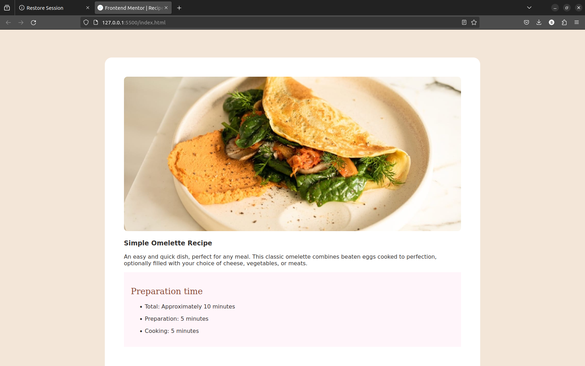

# Frontend Mentor - Recipe page solution

This is a solution to the [Recipe page challenge on Frontend Mentor](https://www.frontendmentor.io/challenges/recipe-page-KiTsR8QQKm). Frontend Mentor challenges help you improve your coding skills by building realistic projects. 

## Table of contents

- [Overview](#overview)
  - [The challenge](#the-challenge)
  - [Screenshot](#screenshot)
  - [Links](#links)
- [My process](#my-process)
  - [Built with](#built-with)
  - [What I learned](#what-i-learned)
- [Author](#author)
- [Acknowledgments](#acknowledgments)

## Overview
### The Challenge

The challenge was to replicate a simple recipe page from Frontendmentor.io.

### Screenshot




### Links

- Solution URL: [Add solution URL here](https://github.com/simonafude/recipe-page.git)
- Live Site URL: [Add live site URL here](https://recipe-page-phi-teal.vercel.app/)

## My process

### Built with

- Semantic HTML5 markup
- CSS custom properties


### What I learned

I learnt how to use the first of type and last of type css styling.

```css
section:first-of-type, section:last-of-type {
  border-bottom: none;
}
```

## Author

- Website - [Simon](https://www.your-site.com)
- Frontend Mentor - [@simonafude](https://www.frontendmentor.io/profile/simonafude)
- Twitter - [@yourusername](https://twitter.com/simon_afude)


## Acknowledgments

I will like to thank Aaliyah for her guidance and time in making it possible to complete this challenge. You are the best.
